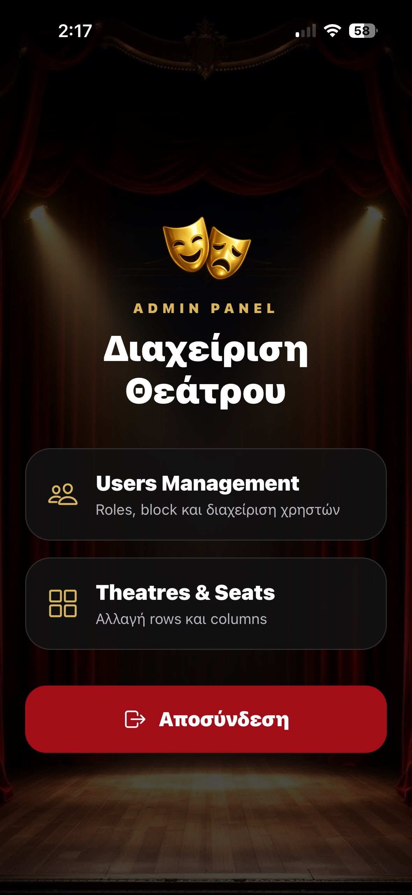
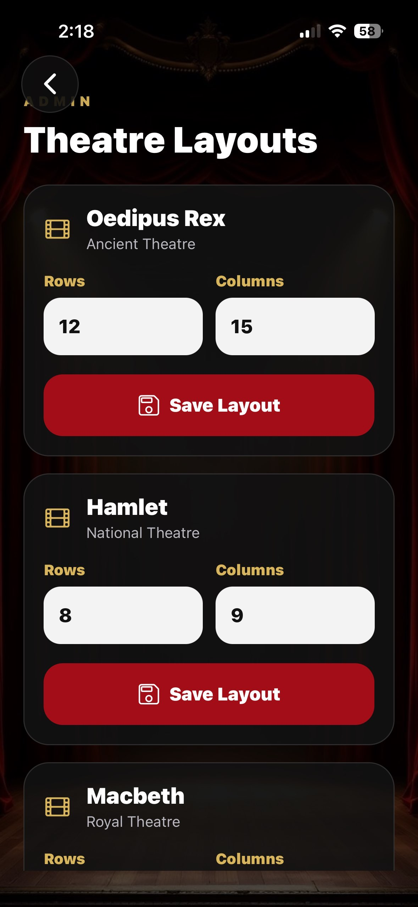
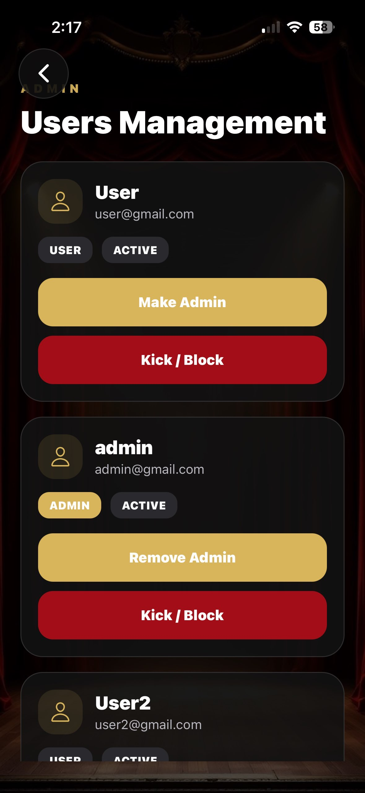

# Θέατρο App / Theater App


Το **Θέατρο App** είναι μια κινηματογραφική εφαρμογή κρατήσεων θεατρικών εισιτηρίων για iOS και Android, υλοποιημένη με Expo και React Native. Οι χρήστες μπορούν να εξερευνήσουν παραστάσεις, να δουν αναλυτικές πληροφορίες, να επιλέξουν καθίσματα μέσω διαδραστικού seat map και να διαχειριστούν τις κρατήσεις τους, ενώ οι διαχειριστές (admins) εποπτεύουν χρήστες και layouts θεάτρων. Το backend βασίζεται σε Firebase Authentication & Cloud Firestore με persistence μέσω AsyncStorage.

---

## ✨ Χαρακτηριστικά

- Ακρίβης email/password authentication με διαχείριση κατάστασης λογαριασμού (`active`/`blocked`).
- Εγγραφή νέων χρηστών με αυτόματη δημιουργία Firestore profile (ρόλος `user`).
- Κατάλογος παραστάσεων με λεπτομερή στοιχεία, φίλτρα UI και CTA για κράτηση.
- Οθόνη Show Details με κινηματογραφική αισθητική και contextual CTA.
- Διαδραστικός seat map με δυναμικές διαστάσεις (`rows`, `columns`) και προσαρμοστικό seat sizing.
- Δημιουργία, ενημέρωση και ακύρωση κρατήσεων με υπολογισμό συνολικού κόστους.
- Προβολή ενεργών κρατήσεων χρήστη με δυνατότητα αλλαγής θέσεων ή ακύρωσης.
- Πίνακας διαχειριστή για προαγωγή/υποβιβασμό ρόλων και απόκλειση χρηστών.
- Διαχείριση layouts θεάτρων (rows/columns) για ακρίβεια seat map ανά παράσταση.
- Επαναχρησιμοποιούμενα κινηματογραφικά components (buttons, inputs, empty/loading states).
- Θέματα τυπογραφίας/χρωμάτων/spacing για συνεκτικό UI.
- Εκτενής τεκμηρίωση αρχιτεκτονικής και backend flows.

---

## 🛠 Τεχνολογίες

| Τεχνολογία | Έκδοση | Περιγραφή |
|------------|--------|-----------|
| Expo SDK | 54.0.33 | Managed runtime, bundler, OTA updates |
| React Native | 0.81.5 | Cross-platform mobile UI |
| React | 19.1.0 | Declarative UI με hooks |
| Firebase JS SDK | 12.13.0 | Authentication & Cloud Firestore |
| @react-navigation/native | 7.2.4 | Navigation container & theming |
| @react-navigation/native-stack | 7.15.0 | Native stack transitions |
| @react-native-async-storage/async-storage | 2.2.0 | Auth persistence |
| react-native-screens | ~4.16.0 | Native navigation primitives |
| react-native-safe-area-context | ~5.6.0 | Safe area handling |
| @expo/vector-icons | ^15.0.3 | Iconography (Ionicons) |
| expo-status-bar | ~3.0.9 | Status bar styling |

---

## 🏛 Αρχιτεκτονική Εφαρμογής

Η εφαρμογή ακολουθεί layered αρχιτεκτονική με έμφαση στη διαύγεια και την επεκτασιμότητα:

- **Presentation Layer**: Οθόνες (`src/screens`) και components (`src/components`) χειρίζονται rendering, user input, local state και feedback (alerts, loading states).
- **Navigation Layer**: `src/navigation/AppNavigator.js` συγκεντρώνει Native Stack (χωρίς headers) και καθορίζει flows ανά ρόλο.
- **Service Layer**: Modules υπό `src/services` ενθυλακώνουν αλληλεπιδράσεις με Firestore/Auth, επιβάλλοντας επαναχρησιμοποιήσιμο και testable data access.
- **Firebase Initialization Layer**: `firebase.js` ρυθμίζει `initializeApp`, `initializeAuth` (AsyncStorage persistence) και εξάγει `auth`/`db`.
- **Theme System**: `src/theme/colors.js`, `typography.js`, `spacing.js` καθορίζουν κινηματογραφική ταυτότητα και διασφαλίζουν ομοιομορφία.

Η separation of concerns επιτρέπει την ανεξάρτητη εξέλιξη UI, πλοήγησης και backend λογικής.

---

## 📁 Δομή Project

```text
src/
├─ components/          # AppButton, AppInput, EmptyState, LoadingState, FloatingBackButton
├─ navigation/          # AppNavigator (Native Stack configuration)
├─ screens/             # Login, Register, Home, ShowDetails, Reservation, Profile, Admin*
├─ services/            # authService, userService, showService, reservationService
├─ theme/               # Colors, typography, spacing tokens
assets/
├─ screenshots/         # login.png, register.png, home.png, details.png, reservation.png, profile.png
architecture-explaining.md  # Αναλυτικό υπόμνημα αρχιτεκτονικής
firebase.js             # Firebase bootstrap & exports
App.js                  # NavigationContainer + StatusBar
index.js                # Expo entry point
```

---

## 🧭 Ροή Πλοήγησης & Χρήστη

- **Αρχικό flow**: `Login → Register → Home`.
- **User flow**:
  - `Home` (παραστάσεις) → `ShowDetails` → `Reservation`.
  - Από `Home` → `Profile` για επισκόπηση/τροποποίηση κρατήσεων.
  - Logout μέσω `Home` με `navigation.reset` σε `Login`.
- **Admin flow**:
  - Μετά το login, redirect σε `AdminHome`.
  - Επιλογές: `AdminUsers` (διαχείριση χρηστών) και `AdminTheatres` (layouts).
  - Logout μέσω `AdminHome` με `logoutUser`.
- **Back navigation**: `FloatingBackButton` (σε screens με full-screen background) προσφέρει συνεπές overlay.

---

## 📸 Στιγμιότυπα


### 🛠 Admin Panel





---

## 🔐 Authentication & Authorization

- `LoginScreen`:
  - `loginUser(email, password)` με trimming και validation.
  - Ανάκτηση προφίλ (`getUserProfile`) και έλεγχος `status` (`blocked` → force logout).
  - Ροές redirect: `admin` → `AdminHome`, αλλιώς `Home`.
- `RegisterScreen`:
  - `registerUser` και `createUserProfile` με default ρόλο `user` και status `active`.
  - Onboarding alerts & transition σε `Home`.
- **Persistence**:
  - `initializeAuth` με `getReactNativePersistence(AsyncStorage)` αποθηκεύει tokens σε επίπεδο συσκευής.
- **Admin Permissions**:
  - `AdminUsersScreen` αποτρέπει self-demotion/block.
  - Ενέργειες ρόλου/κατάστασης γίνονται μέσω `updateUserRole` & `updateUserStatus`.
- **Security Recommendations**:
  - Firestore Rules πρέπει να επιβάλουν ότι οι χρήστες βλέπουν/μεταβάλλουν μόνο δικά τους έγγραφα.
  - Admin-only actions σε `users`/`shows` collections.

---

## 🎟 Σύστημα Κρατήσεων

- **Seat Map Logic** (`ReservationScreen`):
  - Διαβάζει `show.rows` και `show.columns` (fallback 8×9).
  - Υπολογίζει seat size βάσει διαθέσιμου πλάτους συσκευής (min/max όρια) και δυναμικό radius/typography.
  - Δημιουργεί abstraction για rows (`A`, `B`…) και columns (1..n) με ομοιόμορφο spacing.
- **Synchronization**:
  - `getActiveReservationsForShow(show.id)` εξάγει ενεργές κρατήσεις:
    - Θέσεις άλλων χρηστών → `reservedSeats`.
    - Προσωπικές θέσεις → `selectedSeats`.
  - Εμφανίζει reserved seats με απενεργοποίηση επιλογής και διαφορετική παλέτα χρωμάτων.
  - Δημιουργία (`createReservation`) ή ενημέρωση (`updateReservation`) με αναλογικό `totalPrice`.
  - Ακύρωση (`cancelUserReservation`) mark status `cancelled`, διατηρώντας χρονικές σφραγίδες.
- **Transitions**:
  - Μετά από create/update, navigation προς `Home` (για refresh).
  - `ProfileScreen` χρησιμοποιεί `navigation.addListener("focus")` για live ανανέωση λίστας κρατήσεων.

---

## ☁ Firebase Collections & Δομή Δεδομένων

```js
// users/{uid}
{
  name: "Maria Papadopoulou",
  email: "maria@example.com",
  role: "user" | "admin",
  status: "active" | "blocked",
  createdAt: Timestamp
}
```

```js
// shows/{showId}
{
  title: "Οιδίπους Τύραννος",
  theatre: "Εθνικό Θέατρο",
  location: "Αθήνα",
  duration: 120,
  price: 18,
  description: "Περιγραφή",
  rows: 10,          // διαχειρίσιμο
  columns: 12        // διαχειρίσιμο
}
```

```js
// reservations/{reservationId}
{
  userId: "uid-123",
  showId: "show-456",
  showTitle: "Οιδίπους Τύραννος",
  theatre: "Εθνικό Θέατρο",
  price: 18,
  seats: ["B5", "B6"],
  totalPrice: 36,
  status: "active" | "cancelled",
  createdAt: Timestamp,
  updatedAt?: Timestamp,
  cancelledAt?: Timestamp
}
```

**Συστάσεις Rules**:
- `users`: μόνο ο ιδιοκτήτης διαβάζει/ενημερώνει το document, admins μπορούν να ενημερώνουν `role`/`status`.
- `shows`: read για όλους, write μόνο admins.
- `reservations`: create/update για authenticated, αλλά μόνο ο ιδιοκτήτης χειρίζεται συγκεκριμένο `reservationId`. Ακυρώσεις ενημερώνουν `status`.

---

## 🔧 Services & Modules

| Αρχείο | Περιγραφή |
|--------|-----------|
| `src/services/authService.js` | Περιτύλιγμα Firebase Auth (`registerUser`, `loginUser`, `logoutUser`). |
| `src/services/userService.js` | `createUserProfile`, `getUserProfile`, `getAllUsers`, `updateUserRole`, `updateUserStatus`. |
| `src/services/showService.js` | `getShows` (με default seats fallback), `updateShowLayout` για rows/columns. |
| `src/services/reservationService.js` | Αναλύσεις ενεργών κρατήσεων, CRUD για reservations, total price calculation. |
| `src/components/AppButton.js` | Primary/secondary CTA με loaders και shadow styling. |
| `src/components/AppInput.js` | Ενοποιημένα text fields με icons και typographic consistency. |
| `src/components/EmptyState.js` | Cinematic empty collections messaging. |
| `src/components/LoadingState.js` | Loading overlay για κενές λίστες. |
| `src/components/FloatingBackButton.js` | Overlay back button με Ionicons και shadow. |
| `src/theme/colors.js` | Προσαρμοσμένη παλέτα primary (κυανό-κόκκινο), surfaces, text tones. |
| `src/theme/typography.js` | Scale τίτλων/κειμένων. |
| `src/theme/spacing.js` | Consistent spacing tokens. |

---

## 🎨 UX, Εμπειρία & Ανθεκτικότητα

- Σκοτεινά backgrounds (`assets/theater-bg.jpg`) με cinematic overlay για όλες τις οθόνες.
- Hero section με `assets/masks.png` για branding.
- Επαναχρησιμοποιούμενα headers, cards και badges για συνεκτική εμπειρία.
- Alerts με localized messaging για όλα τα σενάρια σφάλματος (auth, Firestore operations).
- Loading states και disabled buttons σε async διαδικασίες αποτρέπουν διπλές ενέργειες.
- Empty states (Home/Profile) διατηρούν καθαρή επικοινωνία κατά την απουσία δεδομένων.
- Σεβασμός σε μικρές συσκευές μέσω responsive padding (`useWindowDimensions`).

---

## 🚀 Εγκατάσταση & Εκτέλεση

```bash
git clone <repository-url>
cd Theater_App
npm install
npx expo start
```

- Εκτέλεση μέσω **Expo Go**, **Android Emulator** ή **iOS Simulator**.
- Απαιτείται Node.js LTS και Expo CLI συμβατό με SDK 54.
- Scripts στο `package.json`:
  - `npm run start`
  - `npm run android`
  - `npm run ios`
  - `npm run web`

---

## 🔧 Ρύθμιση Firebase

1. Δημιουργήστε Firebase project και προσθέστε Web app.
2. Ενεργοποιήστε **Authentication → Email/Password**.
3. Δημιουργήστε collections `users`, `shows`, `reservations`.
4. Αντιγράψτε τα credentials στο `firebase.js`.
5. (Προαιρετικό) Ορίστε admin ρόλο χειροκίνητα (π.χ. `role: "admin"`) σε χρήστη για πρόσβαση στα admin panels.
6. Θέστε Firestore Security Rules για περιορισμό πρόσβασης σύμφωνα με το data model.
7. (Συνίσταται) Προσθέστε δείγματα παραστάσεων με `rows`/`columns` για να εμφανιστούν seat maps.

---

## 🔭 Μελλοντικές Βελτιώσεις

- **Realtime seat synchronization** μέσω `onSnapshot` listeners.
- **Firestore transactions / runTransaction** για ατομική δέσμευση καθισμάτων και αποφυγή race conditions.
- **Integration με Stripe** ή άλλο payment provider για πλήρη αγορά εισιτηρίων.
- **QR ticket generation** για onsite validation.
- **Push notifications** (Expo Notifications) για reminders παραστάσεων.
- **Analytics** (Firebase Analytics, Amplitude) για παρακολούθηση engagement.
- **State management upgrade** (React Query, Zustand) για caching & offline support.
- **TypeScript migration** για static typing και βελτιωμένη developer experience.
- **Internationalization** (i18n) και accessibility improvements (TalkBack/VoiceOver).

---

## 🎓 Ακαδημαϊκό Πλαίσιο

Το project δημιουργήθηκε για το μάθημα **Mobile & Distributed Systems (CN6035)**, με στόχο την εμβάθυνση σε:
- Κατανεμημένες κινητές εφαρμογές.
- BaaS υπηρεσίες και cloud authentication.
- Ασφάλεια και διαχείριση ρόλων.
- Σχεδίαση κινηματογραφικής εμπειρίας χρήστη με React Native.
- Συντήρηση και κλιμάκωση modular αρχιτεκτονικής.

---

## 📚 Συμπληρωματική Τεκμηρίωση

- `architecture-explaining.md`: εκτενές υπόμνημα για flows, αρχιτεκτονική και scalability.
- [Firebase Documentation](https://firebase.google.com/docs)
- [Expo Documentation](https://docs.expo.dev)
- [React Navigation Guide](https://reactnavigation.org/docs/getting-started)

---

## 📄 Άδεια Χρήσης

Το Θέατρο App έχει αναπτυχθεί για εκπαιδευτικούς και ακαδημαϊκούς σκοπούς. Επιτρέπεται η χρήση του ως reference implementation, portfolio showcase ή βάση για ερευνητική εργασία, με σεβασμό στη συνεισφορά των δημιουργών.

---

## 🎬 Επίλογος

Το **Θέατρο App** συνδυάζει σύγχρονες πρακτικές mobile ανάπτυξης με κινηματογραφικό UX και πλήρη διαστρωμάτωση backend υπηρεσιών. Η modular αρχιτεκτονική, η σαφής οριοθέτηση flows και η επικαιροποιημένη τεκμηρίωση το καθιστούν άρτιο παράδειγμα για ακαδημαϊκή αξιολόγηση και βάση για παραγωγική κλιμάκωση.