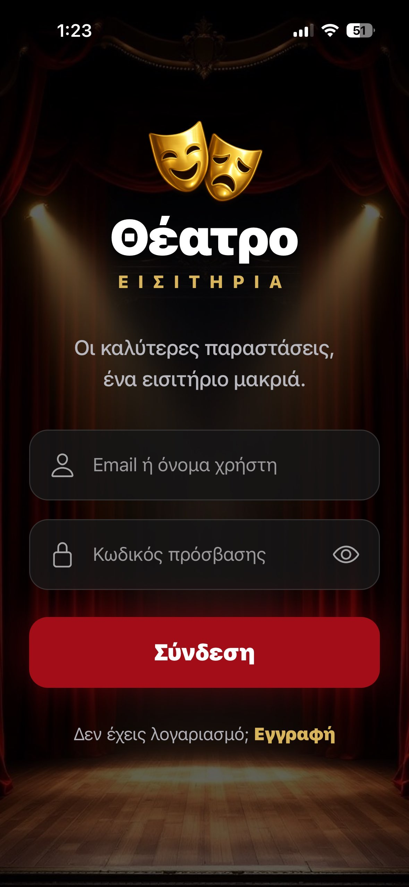
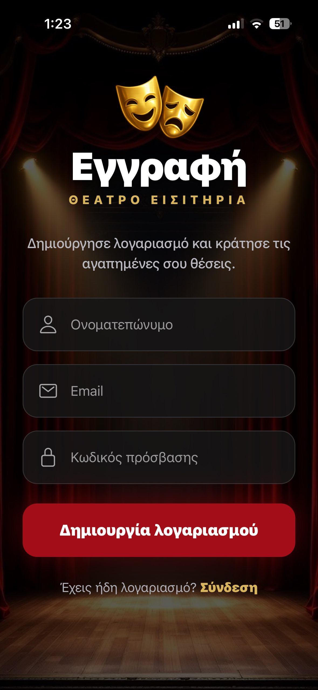
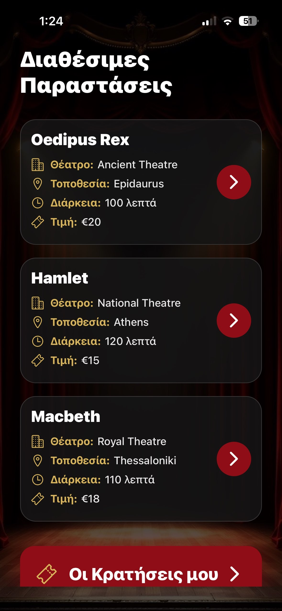
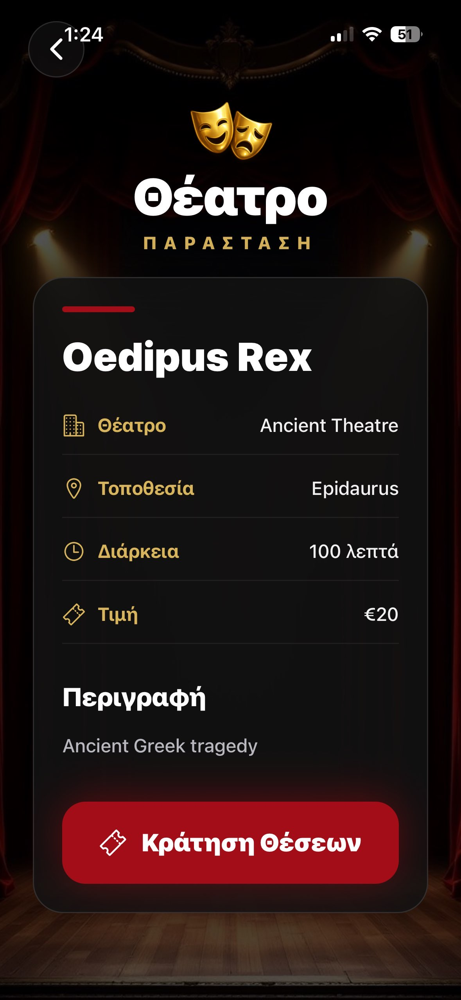
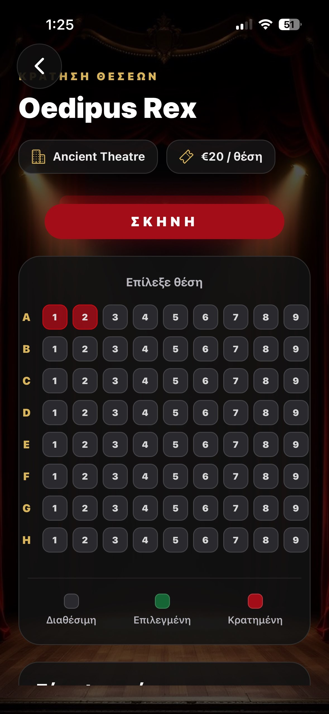
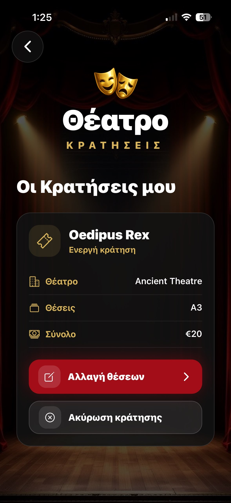

# Θέατρο App / Theater App


Το **Θέατρο App** είναι μια κινηματογραφική εφαρμογή κράτησης εισιτηρίων θεάτρου για κινητές συσκευές, σχεδιασμένη με Expo και React Native. Η εφαρμογή επιτρέπει στους χρήστες να περιηγούνται σε διαθέσιμες παραστάσεις, να βλέπουν λεπτομέρειες, να επιλέγουν θέσεις μέσω διαδραστικού seat map και να διαχειρίζονται τις κρατήσεις τους μέσω Firebase Authentication και Cloud Firestore.

Η αρχιτεκτονική του project ακολουθεί σύγχρονες πρακτικές separation of concerns με διαχωρισμό navigation, services, presentation layer και Firebase backend abstraction.

---

# ✨ Χαρακτηριστικά

- Εγγραφή και σύνδεση χρηστών
- Firebase Authentication
- Persistent authentication state
- Προβολή διαθέσιμων θεατρικών παραστάσεων
- Αναλυτικές πληροφορίες παράστασης
- Διαδραστική επιλογή θέσεων
- Δημιουργία κράτησης
- Επεξεργασία κράτησης
- Ακύρωση κράτησης
- Προφίλ χρήστη με ενεργές κρατήσεις
- Firebase Firestore backend
- Firestore Security Rules
- Responsive cinematic UI
- Reusable components & modular architecture

---

# 🛠 Τεχνολογίες

| Τεχνολογία | Περιγραφή |
|------------|-----------|
| Expo SDK 54 | Managed runtime και development environment για React Native |
| React Native 0.81 | Cross-platform mobile UI framework |
| React 19 | Declarative UI framework με hooks |
| Firebase Authentication | Authentication & JWT token lifecycle |
| Cloud Firestore | NoSQL cloud database |
| React Navigation | Native stack navigation |
| AsyncStorage | Persistent Firebase auth state |
| Expo Vector Icons | Iconography και UI enhancement |

---

# 🏗 Αρχιτεκτονική Εφαρμογής

Η εφαρμογή ακολουθεί layered architecture με στόχο τη συντηρησιμότητα, την επεκτασιμότητα και τον καθαρό διαχωρισμό λογικής.

## Presentation Layer
Οι React Native screens και components διαχειρίζονται:
- rendering UI
- user interactions
- local state
- loading/error states

## Navigation Layer
Το `React Navigation Native Stack` οργανώνει:
- authentication flow
- screen transitions
- route params
- protected navigation flows

## Services Layer
Τα modules του `src/services` αναλαμβάνουν:
- Firestore CRUD operations
- Firebase abstraction
- reusable backend logic

## Firebase Layer
Το `firebase.js`:
- αρχικοποιεί Firebase
- ενεργοποιεί authentication persistence
- παρέχει `auth` και `db`

## Theme System
Το `src/theme` περιέχει:
- colors
- typography
- spacing

ώστε να διατηρείται συνεπής cinematic αισθητική.

---

# 🧭 Αρχιτεκτονική Ροή

```text
React Native UI
       ↓
Navigation Layer
       ↓
Services Layer
       ↓
Firebase SDK
       ↓
Firestore / Authentication
```

---

# 📁 Δομή Project

```txt
src/
├── components/
├── navigation/
├── screens/
├── services/
└── theme/
```

## Περιγραφή Δομής

| Φάκελος | Περιγραφή |
|---|---|
| components | Reusable UI στοιχεία |
| navigation | Stack navigation configuration |
| screens | Κύριες οθόνες εφαρμογής |
| services | Firebase service abstraction |
| theme | Shared design tokens |

---

# 📱 Screenshots

## 🔐 Login Screen



---

## 📝 Register Screen



---

## 🎭 Home Screen



---

## 🎬 Show Details Screen



---

## 🎟 Reservation Screen



---

## 👤 Profile Screen



---

# 🔐 Authentication & Security

Η εφαρμογή χρησιμοποιεί Firebase Authentication για:
- email/password authentication
- JWT token management
- automatic token refresh
- session persistence

## Firestore Security Rules

Οι χρήστες:
- μπορούν να βλέπουν μόνο τα δικά τους reservations
- μπορούν να τροποποιούν μόνο τα δικά τους δεδομένα
- δεν έχουν write access στη συλλογή `shows`

Παράδειγμα Firestore Rule:

```js
match /reservations/{reservationId} {

  allow create: if request.auth != null
    && request.resource.data.userId == request.auth.uid;

  allow update, delete: if request.auth != null
    && resource.data.userId == request.auth.uid;
}
```

---

# 🎟 Σύστημα Κρατήσεων

Η διαδικασία κράτησης ακολουθεί την παρακάτω ροή:

1. Ανάκτηση ενεργών κρατήσεων από Firestore
2. Εντοπισμός κατειλημμένων θέσεων
3. Απενεργοποίηση reserved seats
4. Επιλογή θέσεων από τον χρήστη
5. Δημιουργία ή ενημέρωση κράτησης
6. Επαναφόρτωση UI

Το σύστημα χρησιμοποιεί:
- Firestore queries
- dynamic seat rendering
- state synchronization
- loading protection

---

# ☁ Firebase Collections

## users

```js
{
  name: "Maria",
  email: "maria@example.com",
  createdAt: Timestamp
}
```

---

## shows

```js
{
  title: "Οιδίπους Τύραννος",
  theatre: "Εθνικό Θέατρο",
  location: "Αθήνα",
  duration: 120,
  price: 18,
  description: "Αρχαία τραγωδία"
}
```

---

## reservations

```js
{
  userId: "uid",
  showId: "showId",
  seats: ["A1", "A2"],
  totalPrice: 36,
  status: "active",
  createdAt: Timestamp
}
```

---

# 🚀 Εγκατάσταση

## 1. Clone repository

```bash
git clone <repository-url>
```

## 2. Install dependencies

```bash
npm install
```

## 3. Start Expo

```bash
npx expo start
```

## 4. Run on device

- Expo Go
- Android Emulator
- iOS Simulator

---

# 🔥 Firebase Setup

## Authentication
Ενεργοποιήστε:
- Email/Password provider

## Firestore
Δημιουργήστε:
- users collection
- shows collection
- reservations collection

## firebase.js

Προσθέστε το δικό σας Firebase configuration:

```js
const firebaseConfig = {
  apiKey: "...",
  authDomain: "...",
  projectId: "...",
};
```

---

# 🧪 Error Handling & UX

Η εφαρμογή περιλαμβάνει:

- try/catch handling
- loading indicators
- disabled actions during requests
- localized alerts
- empty states
- responsive layouts

---

# 📈 Μελλοντικές Βελτιώσεις

- Realtime Firestore listeners (`onSnapshot`)
- QR ticket generation
- Stripe payments
- Push notifications
- Admin dashboard
- Analytics integration
- TypeScript migration
- React Query caching
- Firestore transactions

---

# 🎓 Ακαδημαϊκό Πλαίσιο

Η εφαρμογή αναπτύχθηκε στο πλαίσιο του μαθήματος:

## Mobile & Distributed Systems (CN6035)

Στόχος του project ήταν η κατανόηση:
- distributed mobile systems
- cloud backend services
- authentication & authorization
- remote database communication
- state consistency
- mobile UI/UX architecture

---

# 📚 Πρόσθετη Τεκμηρίωση

- [Architecture Documentation](architecture-explaining.md)
- [Firebase Documentation](https://firebase.google.com/docs?utm_source=chatgpt.com)
- [Expo Documentation](https://docs.expo.dev?utm_source=chatgpt.com)

---

# 📝 Άδεια Χρήσης

Το project δημιουργήθηκε για εκπαιδευτικούς και ακαδημαϊκούς σκοπούς.

Μπορεί να χρησιμοποιηθεί ως:
- academic showcase
- portfolio project
- Firebase/React Native reference implementation

---

# 🎬 Επίλογος

Το **Θέατρο App** παρουσιάζει μια σύγχρονη προσέγγιση ανάπτυξης distributed mobile εφαρμογών με React Native και Firebase Backend-as-a-Service.

Η modular αρχιτεκτονική, το cinematic UI και ο σαφής διαχωρισμός layers καθιστούν το project κατάλληλο τόσο για ακαδημαϊκή αξιολόγηση όσο και για επαγγελματικό portfolio showcase.
tion

```
```
